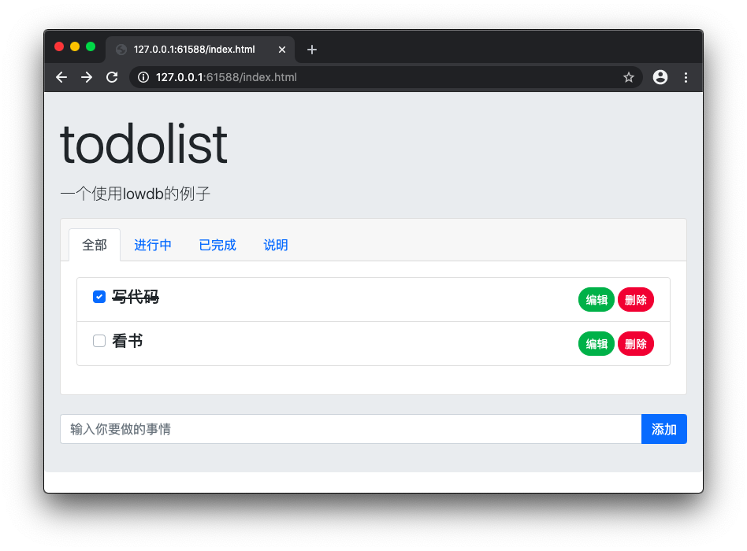

# lowdb_todolist

一个使用vue和lowdb制作的todolist

功能： 添加、编辑、删除、自动保存

### 介绍

[lowdb](https://github.com/typicode/lowdb)是一款小巧轻便的数据库引擎，支持json、yaml和本地存储。

### 为什么使用 lowdb 做本地存储？

由于本地存储不能直接存对象，因此还需要进行序列化，很麻烦。而使用 lowdb 则无需再进行处理，直接一股脑丢给它就是了。

### 如何使用？

1、数据的获取

```
let todo = db.get('todo')
```

如果没有数据，则返回`undefined`

因此，拿到后需要判断一下再赋值

```
if(todo!=undefined){
    this.list=todo
}
```

2、数据的保存

```
db.set('todo', this.list).write()
```

3、自动保存

使用了深度监控，数组内容变化，也会触发。

```
watch:{
    list:{
        handler:function(newValue,oldValue){
            console.log(newValue)
            this.save()
        },
        deep:true,//数组内容发生变化也监控
    }
}
```



演示：https://codetyphon.github.io/lowdb_todolist/index.html


